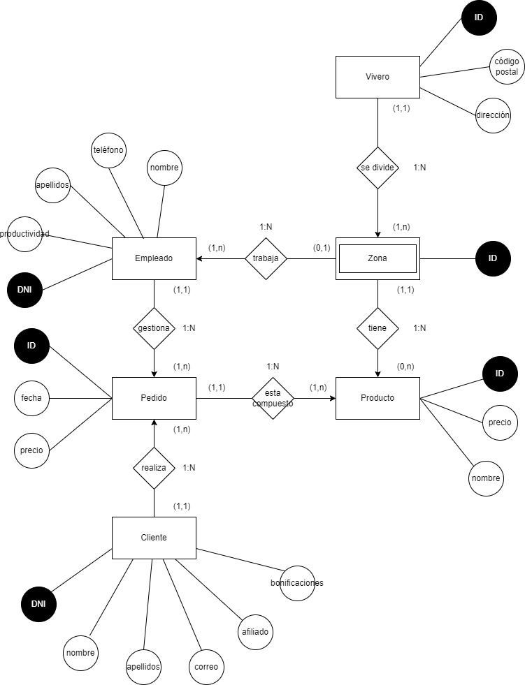
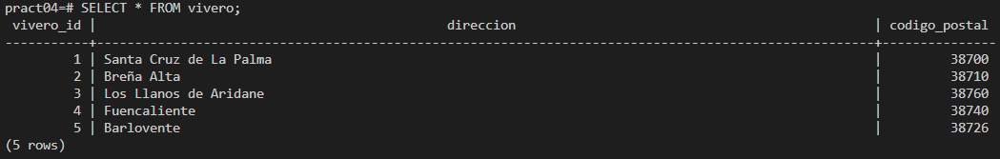
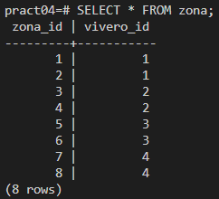
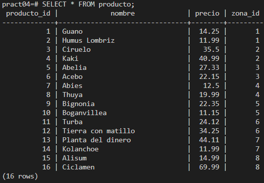
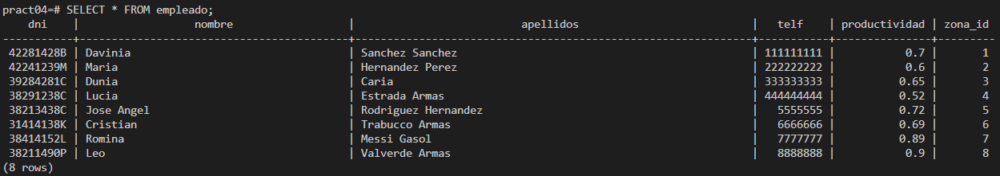
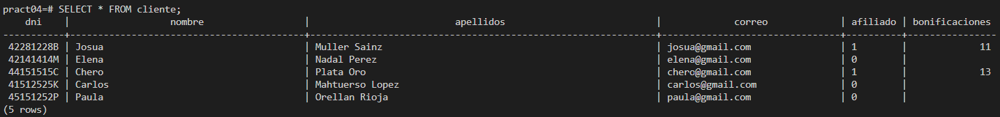
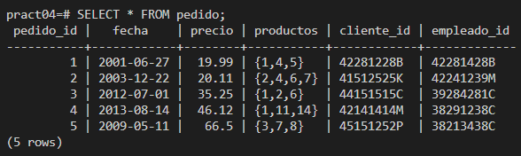

# Prácticas 4. Modelo relacional. Viveros

## Imagen del modelo entidad-relación de los viveros empleado.

## Imagen del diseño relacional realizado.

VIVERO(id, dirección, código_postal)

ZONA(id, id_vivero)
id_vivero: FOREIGN KEY de VIVERO(id)

PRODUCTO(id, nombre, precio, id_zona)
id_zona: FOREIGN KEY de ZONA(id)

EMPLEADO(dni, nombre, apellidos, telefono, productividad, id_zona)
id_zona: FOREIGN KEY de ZONA(id)

CLIENTE(dni, nombre, apellidos, correo, afiliado, bonificaciones)

PEDIDO(id, fecha, precio, productos, id_cliente, id_empleado)
id_cliente: FOREIGN KEY de CLIENTE(id)
id_empleado: FOREIGN KEY de EMPLEADO(id)

## Imagen con la salida de un SELECT de cada tabla de la base de datos.

